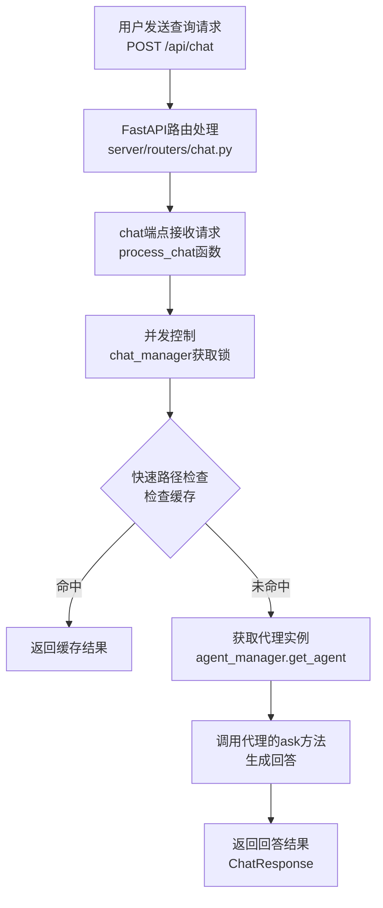
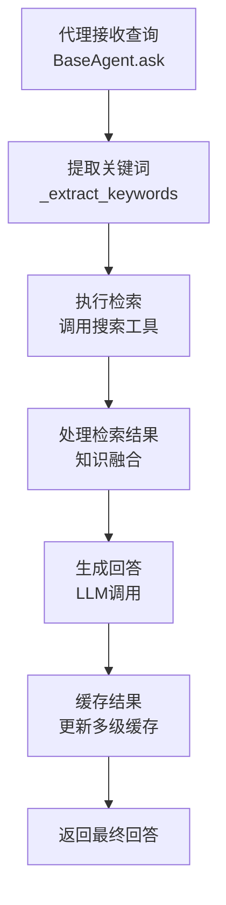
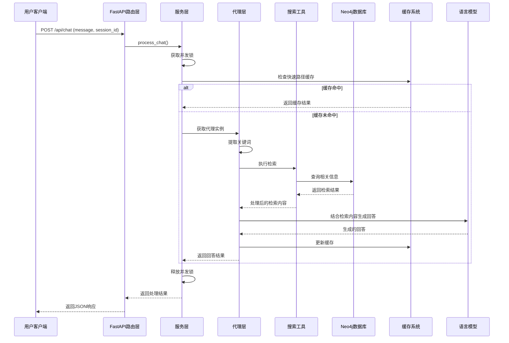

# 业务实现流程文档

## 1. 系统架构概览

Graph-RAG-Agent 是一个基于图数据库和检索增强生成（RAG）技术的智能问答系统。系统采用模块化设计，主要包括以下核心组件：

- **Web服务层**：基于FastAPI的后端服务器
- **路由层**：处理HTTP请求的API端点
- **服务层**：核心业务逻辑实现
- **代理层**：多种专用Agent实现
- **搜索层**：检索策略和工具
- **数据库层**：Neo4j图数据库连接管理
- **缓存层**：多级缓存优化

## 2. 核心业务流程

### 2.1 用户请求处理流程



### 2.2 代理处理流程



## 3. 详细组件流程

### 3.0 系统准备工作

- 系统基础配置：项目根目录路径，项目 RAG 文档路径，项目知识库主题，系统运行并发进程数
- 知识图谱配置：知识图谱主题，实体类型，关系类型定义，知识增量更新策略，文本处理配置，社区检测算法
- 搜索模块配置：搜索返回的顶级实体数量，关系数量，文本块数量，社区数量

### 3.1 知识图谱构建

#### 相关模型初始化

build/main.py - KnowledgeGraphBuilder

- 初始化LLM模型和嵌入模型，ChatOpenAI，OpenAIEmbeddings

- 初始化图数据库，GraphDatabase（官方），Neo4jGraph（langchain）

  ```python
  database.execute_query(cypher, parameters_={"params": "abc"})
  graph.query(cypher, params={"names": name})
  
  # 使用 with 语句 + __enter__ 和 __exit__ 方法，实现资源上下文管理
  # 刷新数据库模式以确保最新的节点标签和关系类型可用
  graph.refresh_schema()
  ```

- 初始化文档处理器、图结构构建器、实体关系提取器

#### 配置文档处理器

- 识别各类型文件，并使用各种 loader / reader 三方库读取文件
- 文档分块拆分，先回车段落拆分，再标点符号拆分，再固定长度拆分
- 使用 HanLP 中文分词器分词（使用 Coarse-Electra-Small-ZH 模型，平衡速度和准确性）
- 最终返回，分割后的文本块列表，每个块是 token 列表（字词列表）

#### 图结构构建器

- 插入文档节点，创建或更新 Document 节点（文件名，文件路径，文件分类）

  ```cypher
  MERGE(d:`__Document__` {fileName: $file_name}) 
  SET d.type=$type, d.uri=$uri, d.domain=$domain
  RETURN d;
  ```

- 插入文本块 Chunk，创建文本块节点，并建立文档与文本块之间的 PART_OF 关系

  ```python
  # 将大数据量 chunks 分割成多个批次，然后依次对每个批次进行插入（使用线线池）
  for i in range(0, len(chunks), batch_size):
      chunk_batches.append(chunks[i:i+batch_size])
  
  with concurrent.futures.ThreadPoolExecutor(max_workers=max_workers) as executor:
      # 提交所有批次任务
      future_to_batch = {
          executor.submit(process_chunk_batch, batch, i * batch_size): i
          for i, batch in enumerate(chunk_batches)
      }
  
  # 创建metadata和Document对象，便于后续处理
  metadata = {
      "position": position,
      "length": len(page_content),  # 文本长度
      "content_offset": offset,    # 在原始文档中的偏移量
      "tokens": len(chunk)        # 令牌数量
  }
  chunk_document = Document(page_content=page_content, metadata=metadata)
  # 准备批处理数据
  chunk_data = {
      "id": current_chunk_id,
      "pg_content": chunk_document.page_content,
      "position": position,
      "length": chunk_document.metadata["length"],
      "f_name": file_name,
      "previous_id": previous_chunk_id,
      "content_offset": offset,
      "tokens": len(chunk)
  }
  batch_data.append(chunk_data)
  
  # 第一个块与文档建立FIRST_CHUNK关系
  relationships.append({"type": "FIRST_CHUNK", "chunk_id": current_chunk_id})
  # 非第一个块与前一个块建立NEXT_CHUNK关系
  relationships.append({
      "type": "NEXT_CHUNK",
      "previous_chunk_id": previous_chunk_id,
      "current_chunk_id": current_chunk_id
  })
  ```

- 维护文本块之间的顺序 NEXT_CHUNK 关系

  ```cypher
  // 第一阶段：创建 Chunk 节点并建立 PART_OF 关系
  chunks_and_part_of = """
  UNWIND $batch_data AS data
  MERGE (c:`__Chunk__` {id: data.id})
  SET c.text = data.pg_content, 
      c.position = data.position, 
      c.fileName = data.f_name,
      c.content_offset = data.content_offset, 
  WITH c, data
  MATCH (d:`__Document__` {fileName: data.f_name})
  MERGE (c)-[:PART_OF]->(d)
  """
  graph.query(chunks_and_part_of, params={"batch_data": batch_data})
  
  // 第二阶段：处理FIRST_CHUNK关系（文档到第一个块的关系）
  query_first_chunk = """
  UNWIND $relationships AS relationship
  MATCH (d:`__Document__` {fileName: $f_name})
  MATCH (c:`__Chunk__` {id: relationship.chunk_id})
  MERGE (d)-[:FIRST_CHUNK]->(c)
  """
  graph.query(query_first_chunk, params={"f_name": file_name, "relationships": first_relationships})
  
  // 第三阶段：处理NEXT_CHUNK关系（块之间的顺序关系）
  query_next_chunk = """
  UNWIND $relationships AS relationship
  MATCH (c:`__Chunk__` {id: relationship.current_chunk_id})
  MATCH (pc:`__Chunk__` {id: relationship.previous_chunk_id})
  MERGE (pc)-[:NEXT_CHUNK]->(c)
  """
  ```

#### 实体关系提取器

- 分批次 + 并行处理单批次中的多个文本块
  - 划分批次，batch_chunks = chunks[i:i+dynamic_batch_size]
  - 并行处理多个文本块，with concurrent.futures.ThreadPoolExecutor(max_workers=self.max_workers) as executor
- 使用 LLM 理解分析文本内容，提取预定义类型的实体和关系
  - 对每个批次的文本块，拼接为一个 batch_text 用户输入
  - prompt（COT 思维链 + FewShot）+ ChatPromptTemplate
  - 使用装饰器 retry 重试 3 次，识别实体和关系
- 将提取的实体与关系进行缓存，存入文件中，cache-key（文本块 hash 值）= pickle.dump(result, f)
- 最后将处理结果（实体与关系）附加到文件内容 字典中

#### 最终图谱完善

- 遍历原文档所有的文本块，创建文件名到实体数据的映射

- 将实体与关系结果合并回文本块数据中

  ```json
  [
     doc["filename"],  # 文件名
     doc["content"],   # 原始内容
     doc["chunks"]     # 文本块列表
     # 文档ID, 文本块ID，
     doc["entity_data"] # 文本块 - 实体与关系
  ]
  ```

- 使用图数据库写入器（自定义封装了 langchain Neo4jGraph 操作 ）

  ```python
  # 遍历所有文本块，是一个文本块一个 GraphDocument
  from langchain_community.graphs.graph_document import GraphDocument, Node, Relationship
  from langchain_core.documents import Document
  
  # 使用正则，将提取的实体关系文本转换为 GraphDocument对象
  node_pattern = re.compile(r'\("entity" : "(.+?)" : "(.+?)" : "(.+?)"\)')
  relationship_pattern = re.compile(r'\("relationship" : "(.+?)" : "(.+?)" : "(.+?)" : "(.+?)" : (.+?)\)')
  
  for match in node_pattern.findall(result):
      node_id, node_type, description = match
  for match in relationship_pattern.findall(result):
      source_id, target_id, rel_type, description, weight = match
      
  new_node = Node(
      id=node_id,
      type=node_type,
      properties={'description': description}
  )
  Relationship(
      source=nodes[source_id],
      target=nodes[target_id],
      type=rel_type,
      properties={
          "description": description,  # 关系描述
          "weight": float(weight)      # 关系权重
      }
  )
  GraphDocument(
      nodes=nodes.values(), # 节点列表
      relationships=relationships, # 关系列表
      source=Document(
          page_content=input_text, # 原始输入文本
          metadata={"chunk_id": chunk_id} # 文本块ID
      )
  )
  ```

  ```python
  # 使用并行处理和批处理，处理并写入所有文件的GraphDocument对象（所有文本块数据）
  - graph_documents (List[GraphDocument]): contain nodes, relationships and source document information to be 
  	added to the graph. Each GraphDocument should encapsulate 封装 the structure 结构 of part of the graph
  - include_source (bool, optional): If True, stores the source document and links it to nodes in the graph using the MENTIONS 提及 relationship. This is useful for tracing back the origin of data. Merges source documents 
  	based on the `id` property from the source document metadata if available; otherwise it calculates the MD5 
      hash of `page_content` for merging process. Defaults to False.
  - baseEntityLabel (bool, optional): If True, each newly created node gets a secondary __Entity__ label 二级标签,
  	which is indexed 索引 and improves import speed and performance 性能. Defaults to False.
  
  # langchain-neo4j
  # Document：由 graph.add_graph_documents() 创建的标签，不是自己创建的 __Document__
  # 在 Neo4j 中，标签是区分大小写且完全匹配的，所以这是两个完全不同的节点类型
  graph.add_graph_documents(
      batch-docs,
      baseEntityLabel=True,  # 使用基础实体标签
      include_source=True    # 包含源文档信息
  )
  
  # 合并Chunk节点与Document节点的关系
  # 将Document节点的 MENTIONS 关系转移到对应的Chunk节点，保留关系的所有属性，转移后删除原Document节点，避免数据冗余
  batch_data = [{"chunk_id": chunk_id} for chunk_id in batch_chunk_ids]
  merge_query = """
  UNWIND $batch_data AS data
  MATCH (c:`__Chunk__` {id: data.chunk_id}), (d:Document {chunk_id:data.chunk_id})
  WITH c, d
  MATCH (d)-[r:MENTIONS]->(e) // 到所有从d出发，通过MENTIONS关系指向的节点e，以及关系r
  MERGE (c)-[newR:MENTIONS]->(e)
  ON CREATE SET newR += properties(r) // 如系已存在则只设置新创建的关系
  //MERGE (c)-[:PART_OF]->(d) // 不需要，因为 d 不是自己创建的文档，标签不同
  DETACH DELETE d // 同时删除节点，及与d相连的所有关系
  """
  # e是通过关系r从Document节点d连接到的任意节点（可能是各种实体节点），r是d和e之间的MENTIONS关系。
graph.query(merge_query, params={"batch_data": batch_data})
  ```


### 3.2 实体索引和社区

- 1


- 执行推理
- COT 思维链 + FewShot

### ====

**文件**：<mcfile name="main.py" path="f:\graph-rag-agent\server\main.py"></mcfile>

**流程说明**：

1. 导入必要的库和模块
2. 创建FastAPI应用实例
3. 注册API路由
4. 初始化数据库连接
5. 配置关闭事件处理器
6. 启动ASGI服务器

**核心代码**：
```python
# 创建FastAPI应用
app = FastAPI(
    title="Graph-RAG Agent API",
    description="基于知识图谱的检索增强生成智能助手API",
    version="1.0.0"
)

# 注册路由
app.include_router(router, prefix="/api", tags=["API"])

# 初始化数据库连接
db_manager = get_db_manager()
driver = db_manager.get_driver()

# 启动服务器
if __name__ == "__main__":
    uvicorn.run(
        "server.main:app",
        host="0.0.0.0",
        port=8000,
        reload=True
    )
```

### 3.2 聊天API处理流程

**文件**：<mcfile name="chat.py" path="f:\graph-rag-agent\server\routers\chat.py"></mcfile>

**流程说明**：
1. 接收用户请求，包括消息内容、会话ID、代理类型等参数
2. 调用process_chat函数处理请求
3. 根据debug参数决定是否返回执行日志
4. 序列化响应结果返回给用户

**核心代码**：
```python
@router.post("/chat", response_model=ChatResponse)
async def chat(
    request: ChatRequest,
    debug: bool = False,
    use_deeper_tool: bool = True,
    show_thinking: bool = False
):
    """
    处理聊天请求，返回非流式响应
    
    Args:
        request: 聊天请求数据，包含消息和会话ID
        debug: 是否启用调试模式
        use_deeper_tool: 是否使用增强版研究工具
        show_thinking: 是否显示思考过程
        
    Returns:
        ChatResponse: 聊天响应对象
    """
    # 使用装饰器测量性能
    with measure_performance():
        # 调用服务层处理聊天请求
        result = await process_chat(
            message=request.message,
            session_id=request.session_id,
            debug=debug,
            agent_type=request.agent_type,
            use_deeper_tool=use_deeper_tool,
            show_thinking=show_thinking
        )
    
    # 格式化响应
    if debug:
        # 调试模式，格式化执行日志
        execution_logs = []
        if "execution_logs" in result:
            for log in result["execution_logs"]:
                execution_logs.append(serialize_log_entry(log))
        return ChatResponse(
            answer=result["answer"],
            raw_thinking=result.get("raw_thinking", ""),
            execution_logs=execution_logs
        )
    else:
        # 普通模式，仅返回回答
        return ChatResponse(answer=result["answer"])
```

### 3.3 聊天服务处理流程

**文件**：<mcfile name="chat_service.py" path="f:\graph-rag-agent\server\services\chat_service.py"></mcfile>

**流程说明**：
1. 获取并发锁，确保同一用户请求串行处理
2. 根据指定类型获取代理实例
3. 检查快速路径缓存，优化性能
4. 根据代理类型调用相应的ask方法
5. 处理思考过程（仅深度研究代理支持）
6. 返回处理结果

**核心代码**：
```python
async def process_chat(
    message: str,
    session_id: str,
    debug: bool = False,
    agent_type: str = "hybrid_agent",
    use_deeper_tool: bool = True,
    show_thinking: bool = False
):
    """
    处理聊天请求的核心逻辑
    """
    # 生成锁的键
    lock_key = f"{session_id}_chat"
    
    # 获取锁，避免并发处理
    chat_manager.acquire_lock(lock_key)
    
    try:
        # 获取指定类型的代理实例
        selected_agent = agent_manager.get_agent(agent_type, session_id)
        
        # 对深度研究代理进行特殊配置
        if agent_type == "deep_research_agent":
            selected_agent.is_deeper_tool(use_deeper_tool)
        
        # 快速路径优化 - 检查缓存
        fast_result = selected_agent.check_fast_cache(message, session_id)
        if fast_result:
            return {"answer": fast_result}
        
        # 根据不同代理类型处理
        if debug:
            # 调试模式，获取执行轨迹
            trace_result = await asyncio.to_thread(
                selected_agent.ask_with_trace,
                message,
                thread_id=session_id
            )
            return trace_result
        else:
            # 普通模式
            if agent_type == "deep_research_agent":
                answer = selected_agent.ask(
                    message,
                    thread_id=session_id,
                    show_thinking=show_thinking
                )
            else:
                answer = selected_agent.ask(
                    message,
                    thread_id=session_id
                )
            return {"answer": answer}
    finally:
        # 释放锁
        chat_manager.release_lock(lock_key)
        chat_manager.cleanup_expired_locks()
```

### 3.4 代理管理流程

**文件**：<mcfile name="agent_service.py" path="f:\graph-rag-agent\server\services\agent_service.py"></mcfile>

**流程说明**：
1. 注册和管理多种类型的代理
2. 为每个会话创建独立的代理实例
3. 提供代理的获取和会话管理功能
4. 支持清除会话历史

**核心代码**：
```python
class AgentManager:
    """
    代理管理器类，负责创建和管理不同类型的代理实例
    """
    
    def __init__(self):
        # 导入各种Agent类
        from agent.graph_agent import GraphAgent
        from agent.hybrid_agent import HybridAgent
        from agent.naive_rag_agent import NaiveRagAgent
        from agent.deep_research_agent import DeepResearchAgent
        from agent.fusion_agent import FusionGraphRAGAgent
        
        # 初始化Agent类映射
        self.agent_classes = {
            "graph_agent": GraphAgent,
            "hybrid_agent": HybridAgent,
            "naive_rag_agent": NaiveRagAgent,
            "deep_research_agent": DeepResearchAgent,
            "fusion_agent": FusionGraphRAGAgent,
        }
        
        # 代理实例池
        self.agent_instances = {}
        
        # 线程锁
        self.agent_lock = threading.RLock()
    
    def get_agent(self, agent_type: str, session_id: str = "default"):
        """
        获取指定类型的代理实例，对每个会话使用独立实例
        """
        # 验证代理类型
        if agent_type not in self.agent_classes:
            raise ValueError(f"未知的agent类型: {agent_type}")
        
        # 使用代理类型和会话ID组合作为实例键
        instance_key = f"{agent_type}:{session_id}"
        
        # 使用线程锁确保并发安全
        with self.agent_lock:
            # 创建新实例或返回现有实例
            if instance_key not in self.agent_instances:
                self.agent_instances[instance_key] = self.agent_classes[agent_type]()
            
            return self.agent_instances[instance_key]
```

### 3.5 基础代理实现流程

**文件**：<mcfile name="base.py" path="f:\graph-rag-agent\agent\base.py"></mcfile>

**流程说明**：
1. 初始化语言模型、嵌入模型和缓存系统
2. 设置代理工作流图，定义状态机和处理节点
3. 实现代理的核心方法，如ask、ask_stream等
4. 提供日志记录和性能监控功能

**核心代码**：
```python
class BaseAgent(ABC):
    """
    代理系统抽象基类，为所有具体代理实现提供统一接口
    """
    
    def __init__(self, cache_dir="./cache", memory_only=False):
        # 初始化语言模型
        self.llm = get_llm_model()
        self.stream_llm = get_stream_llm_model()
        self.embeddings = get_embeddings_model()
        
        # 初始化记忆系统
        self.memory = MemorySaver()
        self.execution_log = []
        
        # 初始化缓存系统
        self.cache_manager = CacheManager(
            key_strategy=ContextAwareCacheKeyStrategy(),
            storage_backend=HybridCacheBackend(...),
            cache_dir=cache_dir,
            memory_only=memory_only
        )
        
        # 设置代理工具
        self.tools = self._setup_tools()
        
        # 设置工作流图
        self._setup_graph()
    
    @abstractmethod
    def _setup_tools(self) -> List:
        """配置代理可用的工具集"""
        pass
    
    def _setup_graph(self):
        """设置代理工作流图"""
        # 定义状态类型
        class AgentState(TypedDict):
            messages: Annotated[Sequence[BaseMessage], add_messages]
        
        # 创建工作流图
        workflow = StateGraph(AgentState)
        # 添加处理节点和边
        # ...
```

### 3.6 混合代理实现流程

**文件**：<mcfile name="hybrid_agent.py" path="f:\graph-rag-agent\agent\hybrid_agent.py"></mcfile>

**流程说明**：
1. 初始化混合搜索工具
2. 配置代理可用的工具列表
3. 设置工作流从检索到生成的边
4. 实现关键词提取功能
5. 实现生成回答节点的逻辑

**核心代码**：
```python
class HybridAgent(BaseAgent):
    """
    混合检索Agent实现，结合多种搜索方法
    """
    
    def __init__(self):
        # 初始化混合搜索工具
        self.search_tool = HybridSearchTool()
        # 设置缓存目录
        self.cache_dir = "./cache/hybrid_agent"
        # 调用父类构造函数
        super().__init__(cache_dir=self.cache_dir)
    
    def _setup_tools(self) -> List:
        """设置混合Agent使用的工具列表"""
        return [
            self.search_tool.get_tool(),
            self.search_tool.get_global_tool(),
        ]
    
    def _add_retrieval_edges(self, workflow):
        """添加工作流中从检索到生成的边"""
        workflow.add_edge("retrieve", "generate")
    
    def _extract_keywords(self, query: str) -> Dict[str, List[str]]:
        """从查询中提取不同层级的关键词"""
        # 检查缓存
        cached_keywords = self.cache_manager.get(f"keywords:{query}")
        if cached_keywords:
            return cached_keywords
        
        try:
            # 使用搜索工具提取关键词
            keywords = self.search_tool.extract_keywords(query)
            # 缓存结果
            self.cache_manager.set(f"keywords:{query}", keywords)
            return keywords
        except Exception as e:
            print(f"关键词提取失败: {e}")
            return {"low_level": [], "high_level": []}
```

### 3.7 混合搜索工具实现流程

**文件**：<mcfile name="hybrid_tool.py" path="f:\graph-rag-agent\search\tool\hybrid_tool.py"></mcfile>

**流程说明**：
1. 初始化检索参数
2. 设置处理链，包括查询处理链和关键词提取链
3. 实现双级检索策略，结合低级细节检索和高级主题检索
4. 融合检索结果生成综合答案

**核心代码**：
```python
class HybridSearchTool(BaseSearchTool):
    """
    混合搜索工具，实现双级检索策略
    """
    
    def __init__(self):
        # 检索参数配置
        self.entity_limit = 15
        self.max_hop_distance = 2
        self.top_communities = 3
        # 调用父类构造函数
        super().__init__(cache_dir="./cache/hybrid_search")
        # 设置处理链
        self._setup_chains()
    
    def _setup_chains(self):
        """设置处理链"""
        # 创建主查询处理链
        self.query_prompt = ChatPromptTemplate.from_messages([
            ("system", LC_SYSTEM_PROMPT),
            ("human", """
                ---分析报告---
                ## 低级内容（实体详细信息）:
                {low_level}
                
                ## 高级内容（主题和概念）:
                {high_level}

                用户的问题是：
                {query}
                
                请综合利用上述信息回答问题...
            """)
        ])
        
        # 构建查询处理链
        self.query_chain = self.query_prompt | self.llm | StrOutputParser()
        
        # 关键词提取链配置
        # ...
```

### 3.8 数据库连接管理流程

**文件**：<mcfile name="neo4jdb.py" path="f:\graph-rag-agent\config\neo4jdb.py"></mcfile>

**流程说明**：
1. 实现单例模式，确保只创建一个连接管理器实例
2. 从环境变量加载数据库连接信息
3. 初始化Neo4j驱动和LangChain Neo4jGraph接口
4. 配置会话池参数
5. 提供查询执行和结果处理方法

**核心代码**：
```python
class DBConnectionManager:
    """
    数据库连接管理器，实现单例模式
    """
    
    _instance = None
    
    def __new__(cls):
        """单例模式实现"""
        if cls._instance is None:
            cls._instance = super(DBConnectionManager, cls).__new__(cls)
            cls._instance._initialized = False
        return cls._instance
    
    def __init__(self):
        """初始化数据库连接管理器"""
        if self._initialized:
            return
        
        # 加载环境变量
        load_dotenv()
        
        # 获取连接信息
        self.neo4j_uri = os.getenv('NEO4J_URI')
        self.neo4j_username = os.getenv('NEO4J_USERNAME')
        self.neo4j_password = os.getenv('NEO4J_PASSWORD')
        
        # 初始化驱动
        self.driver = GraphDatabase.driver(
            self.neo4j_uri,
            auth=(self.neo4j_username, self.neo4j_password)
        )
        
        # 初始化LangChain图实例
        self.graph = Neo4jGraph(
            url=self.neo4j_uri,
            username=self.neo4j_username,
            password=self.neo4j_password,
            refresh_schema=False
        )
        
        # 配置会话池
        self.session_pool = []
        self.max_pool_size = 10
        
        self._initialized = True
```

## 4. 数据流向图



## 5. 关键技术点总结

1. **多代理架构**：系统支持多种专用代理类型，每种代理采用不同的检索和推理策略
2. **双级检索策略**：结合低级细节检索（实体、关系）和高级主题检索（社区、概念）
3. **多级缓存系统**：实现会话级缓存和全局缓存，提高响应速度
4. **图数据库集成**：基于Neo4j的图数据库存储和检索知识
5. **流式响应支持**：支持SSE技术的流式输出，提高用户体验
6. **并发控制**：使用锁机制确保同一用户请求串行处理
7. **模块化设计**：系统各组件高度模块化，便于扩展和维护

## 6. 扩展点和优化方向

1. **代理类型扩展**：可以根据业务需求添加新的专用代理类型
2. **检索策略优化**：可以改进关键词提取和检索算法，提高相关度
3. **缓存策略优化**：可以实现更智能的缓存替换策略
4. **性能监控增强**：可以添加更详细的性能指标收集和分析
5. **分布式部署**：可以扩展为分布式架构，支持更高并发

## 7. 典型用例流程

### 7.1 知识图谱问答流程

1. 用户发送关于特定实体或概念的问题
2. GraphAgent提取关键词并识别实体
3. 从Neo4j图数据库中检索相关实体和关系
4. 基于检索到的图结构信息生成回答
5. 返回包含实体关系的综合回答

### 7.2 深度研究流程

1. 用户发送复杂的研究型问题
2. DeepResearchAgent启动思考流程
3. 执行多轮迭代搜索，逐步深入研究
4. 每轮搜索后分析信息，生成新的子查询
5. 综合多轮搜索结果，生成深度研究报告
6. 返回详细的研究结果和思考过程

## 8. 异常处理机制

系统实现了完善的异常处理机制，主要包括：

1. **API层异常捕获**：捕获和处理所有API请求中的异常
2. **服务层错误处理**：处理业务逻辑中的异常情况
3. **代理执行错误处理**：捕获代理执行过程中的错误
4. **数据库连接错误处理**：处理数据库连接失败的情况
5. **降级策略**：在关键组件失败时提供备用方案

异常信息会被记录到日志中，同时向用户返回友好的错误消息。