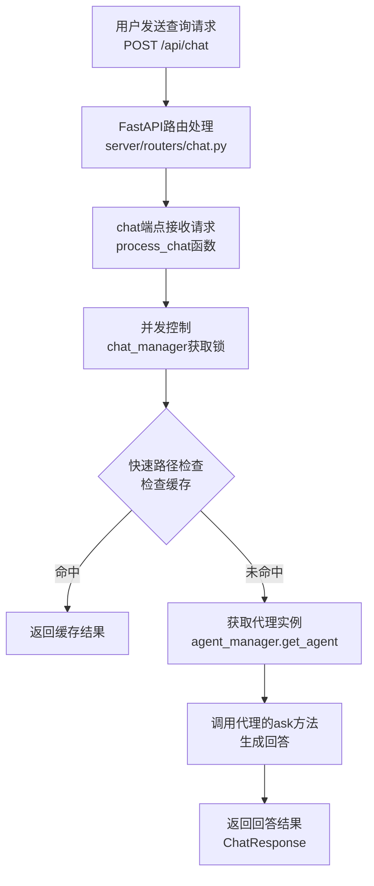
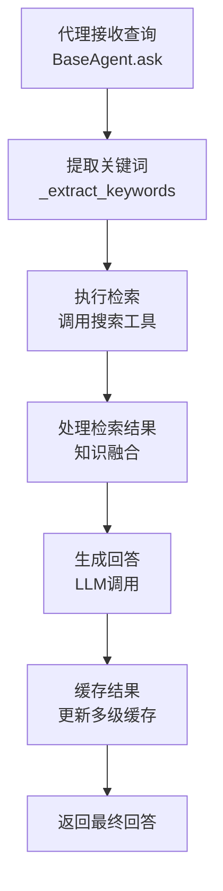
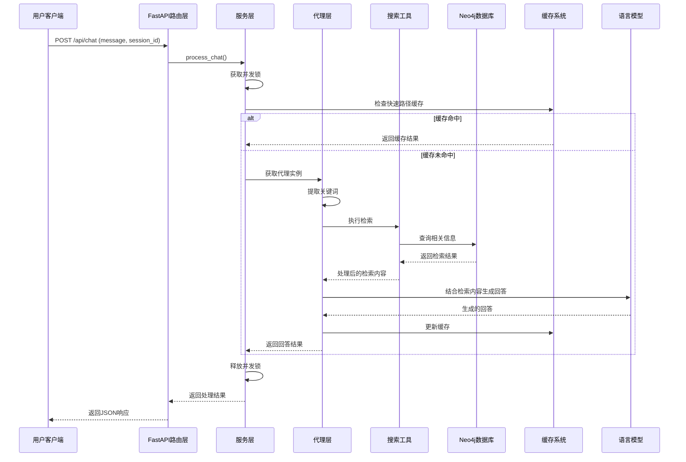

# 业务实现流程文档

## 1. 系统架构概览

Graph-RAG-Agent 是一个基于图数据库和检索增强生成（RAG）技术的智能问答系统。系统采用模块化设计，主要包括以下核心组件：

- **Web服务层**：基于FastAPI的后端服务器
- **路由层**：处理HTTP请求的API端点
- **服务层**：核心业务逻辑实现
- **代理层**：多种专用Agent实现
- **搜索层**：检索策略和工具
- **数据库层**：Neo4j图数据库连接管理
- **缓存层**：多级缓存优化

## 2. 核心业务流程

### 2.1 请求处理流程



### 2.2 代理处理流程

- **DeepResearchAgent**：深度研究代理，能够进行深入分析并展示思考过程
- **NaiveRagAgent**：基础检索增强生成代理
- **GraphAgent**：基于知识图谱的代理
- **HybridAgent**：混合型代理，结合多种策略
- **FusionGraphRAGAgent**：融合图谱和检索增强的代理



## 3. 详细组件流程

### 3.0 系统准备工作

- 系统基础配置：项目根目录路径，项目 RAG 文档路径，项目知识库主题，系统运行并发进程数
- 知识图谱配置：知识图谱主题，实体类型，关系类型定义，知识增量更新策略，文本处理配置，社区检测算法
- 搜索模块配置：搜索返回的顶级实体数量，关系数量，文本块数量，社区数量

### 3.1 知识图谱构建

#### 相关模型初始化

build/main.py - KnowledgeGraphBuilder

- 初始化LLM模型和嵌入模型，ChatOpenAI，OpenAIEmbeddings

- 初始化图数据库，GraphDatabase（官方），Neo4jGraph（langchain）

  ```python
  database.execute_query(cypher, parameters_={"params": "abc"})
  graph.query(cypher, params={"names": name})
  
  # 使用 with 语句 + __enter__ 和 __exit__ 方法，实现资源上下文管理
  # 刷新数据库模式以确保最新的节点标签和关系类型可用
  graph.refresh_schema()
  ```

- 初始化文档处理器、图结构构建器、实体关系提取器

#### 配置文档处理器

- 识别各类型文件，并使用各种 loader / reader 三方库读取文件
- 文档分块拆分，先回车段落拆分，再标点符号拆分，再固定长度拆分
- 使用 HanLP 中文分词器分词（使用 Coarse-Electra-Small-ZH 模型，平衡速度和准确性）
- 最终返回，分割后的文本块列表，每个块是 token 列表（字词列表）

#### 图结构构建器

- 插入文档节点，创建或更新 Document 节点（文件名，文件路径，文件分类）

  ```cypher
  MERGE(d:`__Document__` {fileName: $file_name}) 
  SET d.type=$type, d.uri=$uri, d.domain=$domain
  RETURN d;
  ```

- 插入文本块 Chunk，创建文本块节点，并建立文档与文本块之间的 PART_OF 关系

  ```python
  # 将大数据量 chunks 分割成多个批次，然后依次对每个批次进行插入（使用线线池）
  for i in range(0, len(chunks), batch_size):
      chunk_batches.append(chunks[i:i+batch_size])
  
  with concurrent.futures.ThreadPoolExecutor(max_workers=max_workers) as executor:
      # 提交所有批次任务
      future_to_batch = {
          executor.submit(process_chunk_batch, batch, i * batch_size): i
          for i, batch in enumerate(chunk_batches)
      }
  
  # 创建metadata和Document对象，便于后续处理
  metadata = {
      "position": position,
      "length": len(page_content),  # 文本长度
      "content_offset": offset,    # 在原始文档中的偏移量
      "tokens": len(chunk)        # 令牌数量
  }
  chunk_document = Document(page_content=page_content, metadata=metadata)
  # 准备批处理数据
  chunk_data = {
      "id": current_chunk_id,
      "pg_content": chunk_document.page_content,
      "position": position,
      "length": chunk_document.metadata["length"],
      "f_name": file_name,
      "previous_id": previous_chunk_id,
      "content_offset": offset,
      "tokens": len(chunk)
  }
  batch_data.append(chunk_data)
  
  # 第一个块与文档建立FIRST_CHUNK关系
  relationships.append({"type": "FIRST_CHUNK", "chunk_id": current_chunk_id})
  # 非第一个块与前一个块建立NEXT_CHUNK关系
  relationships.append({
      "type": "NEXT_CHUNK",
      "previous_chunk_id": previous_chunk_id,
      "current_chunk_id": current_chunk_id
  })
  ```

- 维护文本块之间的顺序 NEXT_CHUNK 关系

  ```cypher
  // 第一阶段：创建 Chunk 节点并建立 PART_OF 关系
  chunks_and_part_of = """
  UNWIND $batch_data AS data
  MERGE (c:`__Chunk__` {id: data.id})
  SET c.text = data.pg_content, 
      c.position = data.position, 
      c.fileName = data.f_name,
      c.content_offset = data.content_offset, 
  WITH c, data
  MATCH (d:`__Document__` {fileName: data.f_name})
  MERGE (c)-[:PART_OF]->(d)
  """
  graph.query(chunks_and_part_of, params={"batch_data": batch_data})
  
  // 第二阶段：处理FIRST_CHUNK关系（文档到第一个块的关系）
  query_first_chunk = """
  UNWIND $relationships AS relationship
  MATCH (d:`__Document__` {fileName: $f_name})
  MATCH (c:`__Chunk__` {id: relationship.chunk_id})
  MERGE (d)-[:FIRST_CHUNK]->(c)
  """
  graph.query(query_first_chunk, params={"f_name": file_name, "relationships": first_relationships})
  
  // 第三阶段：处理NEXT_CHUNK关系（块之间的顺序关系）
  query_next_chunk = """
  UNWIND $relationships AS relationship
  MATCH (c:`__Chunk__` {id: relationship.current_chunk_id})
  MATCH (pc:`__Chunk__` {id: relationship.previous_chunk_id})
  MERGE (pc)-[:NEXT_CHUNK]->(c)
  """
  ```

#### 实体关系提取器

- 分批次 + 并行处理单批次中的多个文本块
  - 划分批次，batch_chunks = chunks[i:i+dynamic_batch_size]
  - 并行处理多个文本块，with concurrent.futures.ThreadPoolExecutor(max_workers=self.max_workers) as executor
- 使用 LLM 理解分析文本内容，提取预定义类型的实体和关系
  - 对每个批次的文本块，拼接为一个 batch_text 用户输入
  - prompt（COT 思维链 + FewShot）+ ChatPromptTemplate
  - 使用装饰器 retry 重试 3 次，识别实体和关系
- 将提取的实体与关系进行缓存，存入文件中，cache-key（文本块 hash 值）= pickle.dump(result, f)
- 最后将处理结果（实体与关系）附加到文件内容 字典中

#### 最终图谱完善

- 遍历原文档所有的文本块，创建文件名到实体数据的映射

- 将实体与关系结果合并回文本块数据中

  ```json
  [
     doc["filename"],  # 文件名
     doc["content"],   # 原始内容
     doc["chunks"],    # 文本块列表
     chunk_document,	 # 文档ID, 文本块ID，
     doc["entity_data"] # 文本块 - 实体与关系
  ]
  ```

- 使用图数据库写入器（自定义封装了 langchain Neo4jGraph 操作 ）

  ```python
  # 遍历所有文本块，是一个文本块一个 GraphDocument
  from langchain_community.graphs.graph_document import GraphDocument, Node, Relationship
  from langchain_core.documents import Document
  
  # 使用正则，将提取的实体关系文本转换为 GraphDocument对象
  node_pattern = re.compile(r'\("entity" : "(.+?)" : "(.+?)" : "(.+?)"\)')
  relationship_pattern = re.compile(r'\("relationship" : "(.+?)" : "(.+?)" : "(.+?)" : "(.+?)" : (.+?)\)')
  
  for match in node_pattern.findall(result):
      node_id, node_type, description = match
  for match in relationship_pattern.findall(result):
      source_id, target_id, rel_type, description, weight = match
      
  new_node = Node(
      id=node_id,
      type=node_type,
      properties={'description': description}
  )
  Relationship(
      source=nodes[source_id],
      target=nodes[target_id],
      type=rel_type,
      properties={
          "description": description,  # 关系描述
          "weight": float(weight)      # 关系权重
      }
  )
  GraphDocument(
      nodes=nodes.values(), # 节点列表
      relationships=relationships, # 关系列表
      source=Document(
          page_content=input_text, # 原始输入文本
          metadata={"chunk_id": chunk_id} # 文本块ID
      )
  )
  ```

  ```python
  # 使用并行处理和批处理，处理并写入所有文件的GraphDocument对象（所有文本块数据）
  - graph_documents (List[GraphDocument]): contain nodes, relationships and source document information to be 
  	added to the graph. Each GraphDocument should encapsulate 封装 the structure 结构 of part of the graph
  - include_source (bool, optional): If True, stores the source document and links it to nodes in the graph using the MENTIONS 提及 relationship. This is useful for tracing back the origin of data. Merges source documents 
  	based on the `id` property from the source document metadata if available; otherwise it calculates the MD5 
      hash of `page_content` for merging process. Defaults to False.
  - baseEntityLabel (bool, optional): If True, each newly created node gets a secondary __Entity__ label 二级标签,
  	which is indexed 索引 and improves import speed and performance 性能. Defaults to False.
  
  # langchain-neo4j
  # Document：由 graph.add_graph_documents() 创建的标签，不是自己创建的 __Document__
  # 在 Neo4j 中，标签是区分大小写且完全匹配的，所以这是两个完全不同的节点类型
  graph.add_graph_documents(
      batch-docs,
      baseEntityLabel=True,  # 使用基础实体标签
      include_source=True    # 包含源文档信息
  )
  
  # 合并Chunk节点与Document节点的关系
  # 将Document节点的 MENTIONS 关系转移到对应的Chunk节点，保留关系的所有属性，转移后删除原Document节点，避免数据冗余
  batch_data = [{"chunk_id": chunk_id} for chunk_id in batch_chunk_ids]
  merge_query = """
  UNWIND $batch_data AS data
  MATCH (c:`__Chunk__` {id: data.chunk_id}), (d:Document {chunk_id:data.chunk_id})
  WITH c, d
  MATCH (d)-[r:MENTIONS]->(e) // 到所有从d出发，通过MENTIONS关系指向的节点e，以及关系r
  MERGE (c)-[newR:MENTIONS]->(e)
  ON CREATE SET newR += properties(r) // 如系已存在则只设置新创建的关系
  //MERGE (c)-[:PART_OF]->(d) // 不需要，因为 d 不是自己创建的文档，标签不同
  DETACH DELETE d // 同时删除节点，及与d相连的所有关系
  """
  # e是通过关系r从Document节点d连接到的任意节点（可能是各种实体节点），r是d和e之间的MENTIONS关系。
  graph.query(merge_query, params={"batch_data": batch_data})
  ```


### 3.2 实体索引和社区

```python
index_query = "CREATE INDEX IF NOT EXISTS FOR (e:`__Entity__`) ON (e.id)"  # 实体ID B树索引 - 快速查找特定实体
graph.query(index_query)

# 清除已有的向量索引，避免索引冲突
# 从现有图中创建Neo4j向量存储对象
vector_store = Neo4jVector.from_existing_graph(
    self.embeddings,
    node_label=node_label,
    text_node_properties=text_properties,
    embedding_node_property=embedding_property
)

# 获取所有需要处理的实体，批量获取实体的文本内容，用于嵌入计算
embeddings.embed_documents(batch-docs)
update_data.append({
     "id": entity['neo4j_id'],  # Neo4j原生ID，用于精确定位实体节点
     "embedding": embeddings[i]  # 计算好的向量嵌入
})
query = f"""
UNWIND $updates AS update
MATCH (e) WHERE id(e) = update.id
SET e.{embedding_property} = update.embedding
"""
graph.query(query, params={"updates": update_data})

# 导入Neo4j图数据科学库，图投影与管理，图算法执行，将节点分组到不同的社区中
# 检测和合并相似实体，社区检测并设置、中心性分析、路径发现
from graphdatascience import GraphDataScience
# 第一阶段：获取合并建议 - 使用LLM分析哪些实体应该合并
# 第二阶段：执行合并 - 在图数据库中实际执行实体合并操作
# 第三阶段：关系清理 - 合并实体后，清理可能产生的重复关系
result = self.gds.wcc.write(
    self.G,
    writeProperty="wcc",
    relationshipTypes=["SIMILAR"],
    consecutiveIds=True  # 使用连续ID优化存储
)
result = self.gds.leiden.write(
    self.G,
    writeProperty="communities",
    includeIntermediateCommunities=True,
    relationshipWeightProperty="weight",
    **self._get_optimized_leiden_params()
)

# 格式化社区信息为LLM可处理的字符串，调用LLM生成摘要，格式化输出，保存摘要
```

### 3.3 自动化方案选型

#### LLMGraphTransformer

- from langchain_core.documents import Document：自定义拆分文本块（RecursiveCharacterTextSplitter），将其封装到 Document 对象 Documents.
- from langchain_experimental.graph_transformers import LLMGraphTransformer：创建对象时，指定提取提示词，节点类型提取约束，关系类型提取约束
- graphDocuments = LLMGraphTransformer.convert_to_graph_documents(Documents)：将文本块 Documents 按照提示词/默认规则提取实体及关系，封装为 Node，Relationship，GraphDocument
- graph.add_graph_documents(graphDocuments)：使用 langchain-neo4j 内置方法插入 GraphDocument 到数据库，指定 include_source，baseEntityLabel
- Neo4jVector.from_documents，Neo4jVector.from_existing_graph：在当前图中，对文本块创建向量索引，用于向量检索

**优点：**

- 自动化，节省人力，快速从文本中提取知识图谱。

**缺点：**

- 不会自动维护原始文档与文本块之间的层次结构。
- 如果文本块之间有关联，它也不会自动处理跨文本块的实体合并（除非使用全局索引或后续处理）。
- 通常只处理文本块级别的图文档，不会自动构建文本块与原始文档之间的关系。如果需要保留原始文档的信息，并建立文本块与原始文档的关系，则需要自己处理。
- 也不会自动生成社区节点，及其关联的关系

因此，此方案适用于对准确性要求不高、快速构建原型的场景。对于生产环境，如果对知识图谱的质量要求很高，可能需要后续的人工校验或更复杂的流程。

#### 手动编写流程

- 自定义拆分文本块（RecursiveCharacterTextSplitter / 或手动拆分-按段落标点+ 分词库等规则）
- 手写 cypher 根据文本块中的信息，插入文档，文本块节点，及文本块-文档关系
- 然后根据文本块中的信息及 prompt 提示词，使用 LLM 提取实体和关系
- from langchain_core.documents import Document：根据文本块中的信息，将其封装到 Document 对象 Documents
- from langchain_community.graphs.graph_document import GraphDocument
- 将所有数据（文档内容，文本块 Documents，实体与关系）手动封装为 Node，Relationship，GraphDocument
- 使用 langchain-neo4j graph.add_graph_documents 插入 GraphDocument 到数据库，指定 include_source，baseEntityLabel
- 不会自动生成社区节点，及其关联的关系
- 创建新的向量索引，用于向量检索

**优势：**

- 可控性强，可以精确控制提取的实体和关系。
- 可以灵活地构建原始文档与文本块的关系，便于文档级别的操作。
- 可以进行优化，比如批量处理、错误处理、事务管理等。

### 3.4 增量更新管理

- 文件变更检测，到知识图谱更新、嵌入更新、一致性验证、社区检测

- 检测文件变更并更新图谱 - 通过IncrementalGraphUpdater实现

  - 新增、修改文件嵌入更新、删除文件清理、图谱合并
  - **文件的哈希值 + 文件注册表**
  
- 更新实体和Chunk的Embedding - 通过EmbeddingManager处理

- 图谱合并，验证图谱一致性 - 使用GraphConsistencyValidator确保数据完整性

  - **采用 MERGE 操作确保数据一致性**
  - 验证检查，**图中异常的节点及关系（无关系的节点），并修复**

- 处理社区检测和摘要生成 - 通过社区检测算法和摘要工具

- 支持手动编辑同步 - 使用ManualEditManager确保用户编辑不被覆盖

  ```cypher
  SET e.manual_edit = false
  SET e.created_by = null
  SET e.edited_by = null
  SET e.system_generated = true
  SET r.manual_edit = false
  
  // 通过Neo4j触发器（APOC插件）自动记录节点和关系的变更
  CALL apoc.trigger.install
  SET n.updated_at = datetime()
  ```

- 后台运行和定时调度 - 通过IncrementalUpdateScheduler实现自动化

  - 管理文件变更检测、实体嵌入更新、社区检测、图结构完整性验证等的更新频率
  - **基于时间阈值的调度决策系统**
  - 定时更新和按需更新两种模式，自定义调度策略

### 3.5 统一缓存管理

#### 核心功能

1. 多级缓存查找（精确匹配 + 语义相似匹配）
2. 可插拔的（动态的）缓存键生成策略
3. 可配置的存储后端（内存、磁盘、混合）
4. 缓存质量控制和验证机制（缓存无数据 + 人工反馈更新机制）
5. 性能指标收集（缓存无数据 + 人工反馈更新机制）
6. 向量相似性匹配，支持语义级别的缓存查找

#### 缓存设计模式

- 策略模式（可插拨的，多态的）：用于缓存键生成策略，根据不同的需求或使用场景来生成不同 key
  - 简单查询缓存：基于查询字符串内容生成缓存键，不考虑上下文
  - 全局缓存键策略：仅使用查询内容生成缓存键，完全忽略会话ID，线程ID和其他上下文信息（将它们处理掉）
  - 上下文感知的缓存策略：将查询与其会话上下文结合生成缓存键，且要区分线程会话、上下文历史、版本号、查询内容
- 适配器模式（开闭原则，多态的）：用于不同存储后端的适配
  - 内存缓存后端：python 字典存储 + LRU 最近最少使用策略
  - 磁盘缓存后端：file + 元数据存储 + threading.RLock() 可重入锁 + 复合淘汰策略（访问频率+新近度+文件大小）
  - 混合缓存后端实现（内存+磁盘）：多级缓存策略：先查内存，内存未命中再查磁盘
- 装饰器模式：用于线程安全和性能监控
  - 为缓存后端增加线程安全（threading.RLock() 可重入锁）：通过组合方式包装现有缓存存储后端，为其添加线程安全特性

#### 答案质量验证

目的是确保返回给用户的答案满足基本质量要求，防止低质量缓存被使用。采用多级验证策略，优先使用缓存元数据，然后是自定义验证器，最后是默认验证逻辑。

- 缓存元数据：采用人工反馈更新机制
- 自定义验证器：自定义的验证逻辑
- 默认验证逻辑：答案长度检查 + 关键词匹配（相关性匹配）

### 3.6 各种代理服务实现

#### BaseSearchTool

- 搜索工具基础类，提供通用功能和基础设施。实现了共享的搜索逻辑、数据库连接、缓存机制和性能监控等功能。

- 配置模型、基于上下文-关键字的缓存管理、Neo4j连接（langchain Neo4jGraph）、代理工作流搭建

  - Neo4jGraph，graph.query(query, params=params)

  - 原生的 GraphDatabase.driver.session().run(Query(text=cypher, timeout=10), parameters=params or {})

    ```cypher
    // 构建Neo4j向量搜索查询
    cypher = """
    CALL db.index.vector.queryNodes('vector', $limit, $embedding)
    YIELD node, score
    RETURN node.id AS id, score
    ORDER BY score DESC
    """
    
    // 基于文本匹配的搜索方法（关键词匹配，作为向量搜索的备选）
    cypher = """
    MATCH (e:__Entity__)
    WHERE e.id CONTAINS $query OR e.description CONTAINS $query
    RETURN e.id AS id
    LIMIT $limit
    """
    ```

- 数据向量相似度计算：numpy 计算余弦相似度

- 设置处理链，用于配置各种LLM处理链和提示模板

  ```python
  # 创建动态工具类，注意继承BaseTool，实现自定义搜索工具与LangChain工具系统的无缝集成
  def get_tool(self) -> BaseTool:
      """
      获取搜索工具实例，负责将BaseSearchTool的子类实例转换为LangChain的BaseTool对象。
      通过创建动态的工具类，实现了自定义搜索工具与LangChain工具系统的无缝集成
  
      返回: BaseTool: 一个基于当前搜索工具类的LangChain BaseTool实例，包含名称、描述和执行方法
  
      技术特点：
      - 动态类创建：在运行时动态定义工具类
      - 委托模式：将工具执行委托给原始搜索工具实例
      - 接口适配：将自定义工具适配到LangChain工具接口
      - 同步执行：只实现同步执行方法
      - 命名约定：使用类名小写作为工具名称
      """
      # 创建动态工具类，注意继承BaseTool
      class DynamicSearchTool(BaseTool):
          name : str= f"{self.__class__.__name__.lower()}"
          description : str = "高级搜索工具，用于在知识库中查找信息"
  
          # 将调用委托给当前实例的search方法
          def _run(self_tool, query: Any) -> str:
              return self.search(query)
  
          # 异步执行
          def _arun(self_tool, query: Any) -> str:
              raise NotImplementedError("异步执行未实现")
  
      return DynamicSearchTool()
  ```

#### LocalSearchTool

基于向量检索的社区内部精确查询功能（graphrag 的局部检索），继承自 BaseSearchTool 基类。并增强了历史感知检索、对话上下文管理和结果缓存等特性。

- 基于向量相似度的文本检索
- 采用分层检索策略，先定位相关实体，再扩展获取相关文本和关系
  - 内部进行排序后，获取最相关的数据
  - 基于向量相似度进行排序，过滤文档

- 支持多种信息类型的整合（文本、实体、关系、社区- 计算每个社区包含的文本块数量作为权重）
- 图结构的遍历与信息提取
- 使用 LLM + prompt 生成结构化最终答案
- 支持上下文管理（with语句）

#### GlobalSearchTool

- 通过关键词提取与分析、社区层级数据过滤+检索、Map-Reduce模式（要点拆分+结果合并模式）、批量处理、结果合并和结果缓存机制等步骤，提供了一种高效的全局信息检索机制。
- 关键词提取：使用 LLM 从查询中提取关键概念，将用于在知识库中过滤和检索相关的社区数据（层级 + 关键词过滤，返回一个列表）。为后续的 Map-Reduce 处理提供输入。
- Map-Reduce 模式：拆分为多批次，并行处理社区答案的要点列表，从图社区中提取关键信息。然后整合 Map 结果并生成最终答案

Map 阶段实现：

- 将大量社区数据分批次处理（可指定每批次的数量），并生成每个批次的中间分析结果。
- 然后针对每个批次，批量处理多个社区数据，而不是逐个处理（合并多个社区的数据）
- 通过一次调用LLM处理多个社区的组合数据，显著减少了LLM调用次数，提高了整体处理效率
- 为Reduce阶段准备高质量输入：生成结构化分析结果

Reduce 阶段：

- 使用 LLM 将 Map 阶段生成的多个中间分析结果，整合为一个综合性的最终答案
- 使用 prompt 设置响应类型为"多个段落"，确保生成结构化的详细回答

#### HybridSearchTool

实现类似 LightRAG 的双级检索策略，结合局部细节检索（实体、关系、文本块）和全局主题检索（社区和概念）

- 双级关键词提取与分类（局部具体实体及关系检索，全局社区抽象检索）
- 多级检索策略（关键词搜索、向量搜索、文本搜索-在实体ID和描述字段中搜索查询文本，串联降级检索策略）
- 并行检索低级和高级内容（level 层级 + 关键词搜索）
- 结果融合与答案生成
- 多级缓存优化
- 全局搜索工具，封装生成

#### DeeperResearchTool

整合社区感知及搜索、动态知识图谱构建和 Chain of Exploration 等功能，通过多步骤的迭代思考-搜索-推理过程，提供更全面的深度研究能力。

- 社区感知搜索增强
  - 查询相关知识社区（结合语义相似度、关键词匹配和社区重要性）
  - 提取社区中的关键实体和关系，时间信息
  - 基于用户查询和社区知识，利用 LLM 生成优化的搜索策略（生成针对性的子查询）

- 动态知识图谱构建
  - 在推理过程中实时构建与问题相关的知识子图，支持因果推理和关系发现
  - 基于种子实体构建知识子图（内存图存储：使用NetworkX管理内存中的知识图谱）
  - 递归探索和扩展知识图谱（递归从当前实体出发，查询其相邻实体和关系，并将新发现的实体和关系添加到 内存子图谱中）
  - 构建基于文档层级结构的图谱（文档分解为文档节点、章节节点、段落节点和特殊元素节）
  - 从文本块中提取实体和关系（prompt + LLM）
  - 识别图谱中的核心实体（使用 PageRank / 图的度中心性分析（入度+出度），识别重要实体）

- Chain of Exploration（探索链）检索
  - 通过模拟人类探索过程，在知识图谱中进行有目的、有策略的多步探索，实现多步自主探索图谱的能力（最大深度 + LLM，逐步扩展探索范围），具有适应性搜索宽度（根据查询复杂度和探索步骤动态调整搜索广度）、记忆机制（记录已探索路径，避免重复探索）和路径优化功能（LLM）。

- 标准版为 DeepResearchTool
- 多步骤思考-搜索-推理循环（迭代式深度搜索策略，逐步深入分析问题）
- 子查询分解与生成（将复杂问题分解为可管理的子问题）
- 双路径搜索（知识库和知识图谱）
- 多轮迭代思考与搜索（结构化思考过程，记录完整的推理步骤）
- 自适应搜索：根据已收集的信息动态调整搜索策略
- 流式响应支持
- 答案验证和质量控制
- 实现多级缓存机制，减少重复计算
- 异常处理和优雅降级
- 性能监控和日志记录

结合多种搜索工具的优势，与其他工具的协同：
- 继承自BaseSearchTool，实现基础搜索功能
- 使用HybridSearchTool，进行关键词提取和混合搜索
- 使用GlobalSearchTool，获取社区和主题信息
- 使用LocalSearchTool，进行知识库检索
- 集成ThinkingEngine，实现结构化思考过程
- 使用DualPathSearcher，整合知识库和知识图谱搜索

#### SearchTool cypher

```python
# 基于现有索引初始化Neo4jVector向量存储
vector_store = Neo4jVector.from_existing_index(
    self.embeddings_model,
    url=neo4j_uri,
    username=neo4j_username,
    password=neo4j_password,
    index_name=index_name, # 向量索引名称
    retrieval_query=final_query # 检索查询 cypher
)
# 返回检索器
return vector_store.as_retriever(
    search_kwargs={"k": self.top_entities}
)
# 执行相似度搜索，获取相关文档
# Neo4jVector 类内部会自动处理 query 的向量转换
# # 1. 向量搜索阶段（自动执行）
# CALL db.index.vector.queryNodes("index_name", $top_entities, $query_vector)
# YIELD node, score
#
# # 2. 你的 final_query 阶段（处理搜索结果）
# WITH collect(node) as nodes  # nodes 已经是向量搜索的结果
# // 这里的所有查询都是基于已经找到的节点进行图遍历，只返回文本和元数据
docs = vector_store.similarity_search(
    query, # 用户的搜索查询字符串
    k=self.top_entities,
    params={
        "topChunks": self.top_chunks,
        "topCommunities": self.top_communities,
        "topOutsideRels": self.top_outside_rels,
        "topInsideRels": self.top_inside_rels,
    }
)

    
# node_label: 文本块节点标签，默认为'__Chunk__'
# text_property: 用于计算 embedding 的文本属性名
# embedding_property: 存储 embedding 数据的属性名
vector_store = Neo4jVector.from_existing_graph(
    self.embeddings,
    node_label=node_label,
    text_node_properties=[text_property],
    embedding_node_property=embedding_property
)

await asyncio.to_thread(
    Neo4jVector.from_existing_graph,  # 基于现有图数据结构创建向量索引属性，不改变结构，只添加属性
    embedding=embeddings,  # 使用的嵌入模型（如OpenAIEmbeddings）
    node_label="研究内容",  # 指定了具体的节点标签，只处理这个标签的节点
    text_node_properties=["id", "text"],  # 从这些属性构建文本
    embedding_node_property="embedding",  # 向量存储的属性名
    index_name="vector_index",  # 向量索引名称，用于向量检索
    keyword_index_name="entity_index",  # 全文检索索引名称，用于关键词检索
    search_type=SearchType.HYBRID,  # 搜索策略：混合搜索，使用混合搜索类型
)
```

#### BaseAgent

- 代理系统抽象基类，为所有具体代理实现提供了，统一接口和核心功能框架
- 配置模型、多级缓存管理、工具绑定配置（SearchTool）、代理工作流搭建
- 代理工作流：
  - 从状态中提取消息列表
  - 分析最新的用户消息，提取关键词（LLM / ）
  - 增强用户消息，添加关键词元数据
  - 使用绑定工具的LLM模型分析消息
  - 生成回答，并返回更新后的状态
  - 生成的回答，同步更新到缓存中。之后查询时，先查缓存

#### GraphAgent

基于知识图谱的代理（智能体），主要特点包括本地和全局搜索能力、文档相关性评估、以及两级缓存系统。

- 本地搜索工具模块（）：

#### NaiveRagAgent

基础检索增强生成代理

#### HybridAgent

混合型代理，结合多种策略

#### DeepResearchAgent

深度研究代理，能够进行深入分析并展示思考过程

#### FusionGraphRAGAgent

融合图谱和检索增强的代理

**基础代理文件**：<mcfile name="base.py" path="f:\graph-rag-agent\agent\base.py"></mcfile>

流程说明：

1. 初始化语言模型、嵌入模型、记忆系统（MemorySaver()）和缓存系统（CacheManager）
2. 设置代理工作流图，定义状态机和处理节点
3. 实现代理的核心方法，如ask、ask_stream等
4. 提供日志记录和性能监控功能

核心代码：

**混合代理实现文件**：<mcfile name="hybrid_agent.py" path="f:\graph-rag-agent\agent\hybrid_agent.py"></mcfile>

流程说明：

1. 初始化混合搜索工具
2. 配置代理可用的工具列表
3. 设置工作流从检索到生成的边
4. 实现关键词提取功能
5. 实现生成回答节点的逻辑

**核心代码**：

```python
class HybridAgent(BaseAgent):
    """
    混合检索Agent实现，结合多种搜索方法
    """
    def __init__(self):
        # 初始化混合搜索工具
        self.search_tool = HybridSearchTool()
        # 设置缓存目录
        self.cache_dir = "./cache/hybrid_agent"
        # 调用父类构造函数
        super().__init__(cache_dir=self.cache_dir)
    
    def _setup_tools(self) -> List:
        """设置混合Agent使用的工具列表"""
        return [
            self.search_tool.get_tool(),
            self.search_tool.get_global_tool(),
        ]
    
    def _add_retrieval_edges(self, workflow):
        """添加工作流中从检索到生成的边"""
        workflow.add_edge("retrieve", "generate")
    
    def _extract_keywords(self, query: str) -> Dict[str, List[str]]:
        """从查询中提取不同层级的关键词"""
        # 检查缓存
        cached_keywords = self.cache_manager.get(f"keywords:{query}")
        if cached_keywords:
            return cached_keywords
        
        try:
            # 使用搜索工具提取关键词
            keywords = self.search_tool.extract_keywords(query)
            # 缓存结果
            self.cache_manager.set(f"keywords:{query}", keywords)
            return keywords
        except Exception as e:
            print(f"关键词提取失败: {e}")
            return {"low_level": [], "high_level": []}
```

### 3.7 混合搜索工具实现流程

- 执行推理
- COT 思维链 + FewShot

**文件**：<mcfile name="hybrid_tool.py" path="f:\graph-rag-agent\search\tool\hybrid_tool.py"></mcfile>

**流程说明**：

1. 初始化检索参数
2. 设置处理链，包括查询处理链和关键词提取链
3. 实现双级检索策略，结合低级细节检索和高级主题检索
4. 融合检索结果生成综合答案

**核心代码**：

```python
class HybridSearchTool(BaseSearchTool):
    """
    混合搜索工具，实现双级检索策略
    """
    
    def __init__(self):
        # 检索参数配置
        self.entity_limit = 15
        self.max_hop_distance = 2
        self.top_communities = 3
        # 调用父类构造函数
        super().__init__(cache_dir="./cache/hybrid_search")
        # 设置处理链
        self._setup_chains()
    
    def _setup_chains(self):
        """设置处理链"""
        # 创建主查询处理链
        self.query_prompt = ChatPromptTemplate.from_messages([
            ("system", LC_SYSTEM_PROMPT),
            ("human", """
                ---分析报告---
                ## 低级内容（实体详细信息）:
                {low_level}
                
                ## 高级内容（主题和概念）:
                {high_level}

                用户的问题是：
                {query}
                
                请综合利用上述信息回答问题...
            """)
        ])
        
        # 构建查询处理链
        self.query_chain = self.query_prompt | self.llm | StrOutputParser()
        
        # 关键词提取链配置
        # ...
```


### ==== 

searchTool, agent 相关逻辑


### 3.4 FastAPI 请求处理

初始化文件：<mcfile name="main.py" path="f:\graph-rag-agent\server\main.py"></mcfile>

流程说明：

1. 导入必要的库和模块
2. 创建FastAPI应用实例
3. 注册API路由
4. 初始化数据库连接
5. 配置关闭事件处理器
6. 启动ASGI服务器

API 处理流程：<mcfile name="chat.py" path="f:\graph-rag-agent\server\routers\chat.py"></mcfile>

流程说明：

1. 接收用户请求，包括消息内容、会话ID、代理类型等参数
2. 调用process_chat函数处理请求
3. 根据debug参数决定是否返回执行日志
4. 序列化响应结果返回给用户

### 3.5 聊天服务处理流程

文件：<mcfile name="chat_service.py" path="f:\graph-rag-agent\server\services\chat_service.py"></mcfile>

流程说明：
1. 获取并发锁，确保同一用户请求串行处理
2. 根据指定类型获取代理实例
3. 检查快速路径缓存，优化性能
4. 根据代理类型调用相应的ask方法
5. 处理思考过程（仅深度研究代理支持）
6. 返回处理结果

核心代码：
```python
async def process_chat(
    message: str,
    session_id: str,
    debug: bool = False,
    agent_type: str = "hybrid_agent",
    use_deeper_tool: bool = True,
    show_thinking: bool = False
):
    """
    处理聊天请求的核心逻辑
    request: 聊天请求数据，包含消息和会话ID
    debug: 是否启用调试模式
    use_deeper_tool: 是否使用增强版研究工具
    show_thinking: 是否显示思考过程
    """
    # 生成锁的键
    lock_key = f"{session_id}_chat"
    
    # 获取锁，避免并发处理
    chat_manager.acquire_lock(lock_key)
    # 线程锁 self.agent_lock = threading.RLock()
    
    try:
        # 获取指定类型的代理实例，为每个会话创建独立的代理实例，及会话管理
        selected_agent = agent_manager.get_agent(agent_type, session_id)
        
        # 对深度研究代理进行特殊配置
        if agent_type == "deep_research_agent":
            selected_agent.is_deeper_tool(use_deeper_tool)
        
        # 快速路径优化 - 检查缓存
        fast_result = selected_agent.check_fast_cache(message, session_id)
        if fast_result:
            return {"answer": fast_result}
        
        # 根据不同代理类型处理
        if debug:
            # 调试模式，获取执行轨迹
            trace_result = await asyncio.to_thread(
                selected_agent.ask_with_trace,
                message,
                thread_id=session_id
            )
            return trace_result
        else:
            # 普通模式
            if agent_type == "deep_research_agent":
                answer = selected_agent.ask(
                    message,
                    thread_id=session_id,
                    show_thinking=show_thinking
                )
            else:
                answer = selected_agent.ask(
                    message,
                    thread_id=session_id
                )
            return {"answer": answer}
    finally:
        # 释放锁
        chat_manager.release_lock(lock_key)
        chat_manager.cleanup_expired_locks()
```

### 3.8 数据库连接管理流程

**文件**：<mcfile name="neo4jdb.py" path="f:\graph-rag-agent\config\neo4jdb.py"></mcfile>

**流程说明**：
1. 实现单例模式，确保只创建一个连接管理器实例
2. 从环境变量加载数据库连接信息
3. 初始化Neo4j驱动和LangChain Neo4jGraph接口
4. 配置会话池参数
5. 提供查询执行和结果处理方法

**核心代码**：
```python
class DBConnectionManager:
    """
    数据库连接管理器，实现单例模式
    """
    
    _instance = None
    
    def __new__(cls):
        """单例模式实现"""
        if cls._instance is None:
            cls._instance = super(DBConnectionManager, cls).__new__(cls)
            cls._instance._initialized = False
        return cls._instance
    
    def __init__(self):
        """初始化数据库连接管理器"""
        if self._initialized:
            return
        
        # 加载环境变量
        load_dotenv()
        
        # 获取连接信息
        self.neo4j_uri = os.getenv('NEO4J_URI')
        self.neo4j_username = os.getenv('NEO4J_USERNAME')
        self.neo4j_password = os.getenv('NEO4J_PASSWORD')
        
        # 初始化驱动
        self.driver = GraphDatabase.driver(
            self.neo4j_uri,
            auth=(self.neo4j_username, self.neo4j_password)
        )
        
        # 初始化LangChain图实例
        self.graph = Neo4jGraph(
            url=self.neo4j_uri,
            username=self.neo4j_username,
            password=self.neo4j_password,
            refresh_schema=False
        )
        
        # 配置会话池
        self.session_pool = []
        self.max_pool_size = 10
        
        self._initialized = True
```

## 4. 数据流向图



## 5. 关键技术点总结

1. **多代理架构**：系统支持多种专用代理类型，每种代理采用不同的检索和推理策略
2. **双级检索策略**：结合低级细节检索（实体、关系）和高级主题检索（社区、概念）
3. **多级缓存系统**：实现会话级缓存和全局缓存，提高响应速度
4. **图数据库集成**：基于Neo4j的图数据库存储和检索知识
5. **流式响应支持**：支持SSE技术的流式输出，提高用户体验
6. **并发控制**：使用锁机制确保同一用户请求串行处理
7. **模块化设计**：系统各组件高度模块化，便于扩展和维护

## 6. 扩展点和优化方向

1. **代理类型扩展**：可以根据业务需求添加新的专用代理类型
2. **检索策略优化**：可以改进关键词提取和检索算法，提高相关度
3. **缓存策略优化**：可以实现更智能的缓存替换策略
4. **性能监控增强**：可以添加更详细的性能指标收集和分析
5. **分布式部署**：可以扩展为分布式架构，支持更高并发

## 7. 典型用例流程

### 7.1 知识图谱问答流程

1. 用户发送关于特定实体或概念的问题
2. GraphAgent提取关键词并识别实体
3. 从Neo4j图数据库中检索相关实体和关系
4. 基于检索到的图结构信息生成回答
5. 返回包含实体关系的综合回答

### 7.2 深度研究流程

1. 用户发送复杂的研究型问题
2. DeepResearchAgent启动思考流程
3. 执行多轮迭代搜索，逐步深入研究
4. 每轮搜索后分析信息，生成新的子查询
5. 综合多轮搜索结果，生成深度研究报告
6. 返回详细的研究结果和思考过程

## 8. 异常处理机制

系统实现了完善的异常处理机制，主要包括：

1. **API层异常捕获**：捕获和处理所有API请求中的异常
2. **服务层错误处理**：处理业务逻辑中的异常情况
3. **代理执行错误处理**：捕获代理执行过程中的错误
4. **数据库连接错误处理**：处理数据库连接失败的情况
5. **降级策略**：在关键组件失败时提供备用方案

异常信息会被记录到日志中，同时向用户返回友好的错误消息。

## == 其他项目案例

- 基于 LangChain + Neo4j 对《悟空传》小说建立知识图谱：https://zhuanlan.zhihu.com/p/716089164
- 

# =====